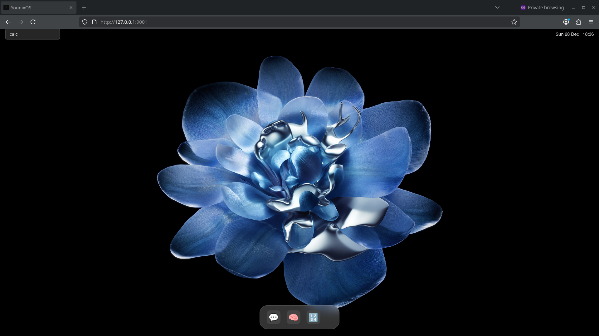
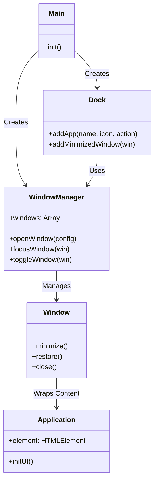

# Personal Web Desktop (PWD)

**Author:** Younus Mashoor  
**Email:** my222ey@student.lnu.se  
**Course:** 1DV528  

## Description
The **Personal Web Desktop** is a single-page web application (SPA) that simulates a modern desktop environment directly in the browser. It features a fully functional window management system, a dynamic dock, and a suite of integrated applications. The design is inspired by modern operating systems, utilizing "Glassmorphism" aesthetics with translucent windows, blurred backgrounds, and smooth animations to provide a premium user experience.

 

## Installation & Startup
1.  **Clone the repository:**
    ```bash
    git clone git@gitlab.lnu.se:1dv528/student/my222ey/a3-spa.git
    cd a3-spa
    ```
2.  **Install dependencies:**
    ```bash
    npm install
    ```
3.  **Start the development server:**
    ```bash
    npm run dev
    ```
4.  open your browser at designated port (usually `http://localhost:5173`).

## Features Implemented

### F1: PWD Functionality
-   **Window Management**: Open, close, minimize, drag, and focus windows.
-   **Z-Index Stacking**: Active windows always appear on top.
-   **Dock**: Launch apps and restore minimized windows.

### F3: Memory Game
-   **Gameplay**: 4x2 grid memory matching game.
-   **Accessibility**: Full keyboard support (Tab to navigate, Enter/Space to flip).
-   **Extension**: Custom "Win Overlay" animation.

### F4 & F6: Chat Application
-   **WebSocket**: Real-time messaging with the course server.
-   **Persistence**: Username and current channel are saved in LocalStorage.
-   **Enhancements (F6)**:
    -   **History Caching**: Messages are cached locally.
    -   **Channel Selection**: Users can switch between chat rooms.
    -   **Emoji Picker**: Integrated emoji support.
    -   **User Switching**: Logout capability to switch users.

### F5: Custom App (Calculator & Music Player)
-   **Calculator**: A fully functional calculator with a modern, iOS-inspired design.
-   **Music Player**: A sleek audio player that plays "Dancing Queen" with a spinning vinyl animation and progress tracking.

### F7: Enhancements
-   **Window Centering**: New windows open perfectly centered.
-   **Spotlight Search**: A quick-access search bar in the status bar to find and launching apps.
-   **Window Maximize/Normalize**: Capablity to maximize windows to full screen and restore them to their original size.
-   **Visual Polish**: High-quality wallpaper, blur effects, and smooth transitions.

## Code Structure (F8)

The application is architected as a modular Single Page Application (SPA) using modern ES6 JavaScript classes. This approach ensures a clean separation of concerns, making the codebase scalable and maintainable.

*   **`main.js`**: This is the application's entry point. It orchestrates the initialization of the primary components, specifically the `WindowManager` and the `Dock`. It also registers all available applications (Chat, MemoryGame, Calculator) and manages global UI elements like the clock and the status bar search functionality.
*   **`WindowManager.js`**: Acting as the core engine of the desktop environment, this class manages the lifecycle of all window instances. It handles complex logic for z-index stacking to ensure the active window is always in the foreground. It also coordinates window focus events and handles the logic for minimizing and restoring windows to and from the dock.
*   **`Window.js`**: This class encapsulates the DOM structure and behavior of a single window. It creates the standard window chrome (header, control buttons, content area) and implements drag-and-drop functionality using mouse events. It also handles the specific behaviors for closing and minimizing itself, communicating back to the WindowManager when necessary.
*   **`Dock.js`**: This component manages the application dock at the bottom of the screen. It distinguishes between "Launchers" (static icons that open new app instances) and "Running/Minimized" apps (dynamic icons or visuals representing active state). It provides visual feedback on hover and manages the event listeners for launching or restoring applications.
*   **`Chat.js`**: A self-contained module for the Chat application. It manages the WebSocket connection to the server, handles the local state for messages and channels, and renders the chat UI. It implements `localStorage` for persistence and provides features like username switching and message history caching.
*   **`MemoryGame.js`**: Encapsulates the logic for the Memory Match game. It manages the grid state, card flipping mechanics, and win conditions. It also implements keyboard accessibility features (tab navigation and key press events) to verify specific assignment requirements.
*   **`Calculator.js`**: A standalone module for the Calculator app. It handles the display and button grid generation, as well as the calculation logic. It is designed to be completely independent of the rest of the system, demonstrating the flexibility of the windowing architecture.
*   **`style.css`**: A comprehensive stylesheet that defines the visual theme. It uses CSS variables for consistent theming and implements the "Glassmorphism" aesthetic through backdrop-filters and translucent backgrounds.

All modules interact through the central `WindowManager`, which acts as the mediator between the individual apps and the desktop environment.

### Class Relationship Diagram


