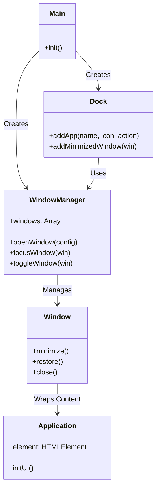

# Personal Web Desktop (PWD)

**Author:** Younus Mashoor  
**Email:** my222ey@student.lnu.se  
**Course:** 1DV528  

## Description
The **Personal Web Desktop** is a single-page web application (SPA) that simulates a modern desktop environment directly in the browser. It features a fully functional window management system, a dynamic dock, and a suite of integrated applications. The design is inspired by modern operating systems, utilizing "Glassmorphism" aesthetics with translucent windows, blurred backgrounds, and smooth animations to provide a premium user experience.

 

## Installation & Startup
1.  **Clone the repository:**
    ```bash
    git clone git@gitlab.lnu.se:1dv528/student/my222ey/a3-spa.git
    cd a3-spa
    ```
2.  **Install dependencies:**
    ```bash
    npm install
    ```
3.  **Start the development server:**
    ```bash
    npm run dev
    ```
4.  open your browser at designated port (usually `http://localhost:5173`).

## Features Implemented

### F1: PWD Functionality
-   **Window Management**: Open, close, minimize, drag, and focus windows.
-   **Z-Index Stacking**: Active windows always appear on top.
-   **Dock**: Launch apps and restore minimized windows.

### F3: Memory Game
-   **Gameplay**: 4x2 grid memory matching game.
-   **Accessibility**: Full keyboard support (Tab to navigate, Enter/Space to flip).
-   **Extension**: Custom "Win Overlay" animation.

### F4 & F6: Chat Application
-   **WebSocket**: Real-time messaging with the course server.
-   **Persistence**: Username and current channel are saved in LocalStorage.
-   **Enhancements (F6)**:
    -   **History Caching**: Messages are cached locally.
    -   **Channel Selection**: Users can switch between chat rooms.
    -   **Emoji Picker**: Integrated emoji support.
    -   **User Switching**: Logout capability to switch users.

### F5: Custom App (Calculator)
-   **Calculator**: A fully functional calculator with a modern, iOS-inspired design.

### F7: Enhancements
-   **Window Centering**: New windows open perfectly centered.
-   **Spotlight Search**: A quick-access search bar in the status bar to find and launch apps.
-   **Visual Polish**: High-quality wallpaper, blur effects, and smooth transitions.

## Code Structure (F8)

The application is built using a modular architecture with ES6 Classes, ensuring separation of concerns and maintainability.

*   **`main.js`**: The entry point of the application. It initializes the `WindowManager` and `Dock`, registers the applications (`Chat`, `MemoryGame`, `Calculator`), and handles the global clock and search bar logic.
*   **`WindowManager.js`**: The core engine for the desktop environment. It manages the list of open windows, handles z-index stacking (bringing focused windows to the front), and coordinates minimize/restore actions.
*   **`Window.js`**: Represents a single window instance. It encapsulates the DOM structure of a window (header with controls, content area) and handles drag-and-drop logic and button events.
*   **`Dock.js`**: Manages the bottom bar. It differentiates between "Launchers" (which create new app instances) and "Minimized Windows" (which restore existing ones).
*   **`Chat.js`, `MemoryGame.js`, `Calculator.js`**: These are the application classes. Each class encapsulates its own state, UI rendering, and event handling, exposing a root `element` that the `Window` class appends to its content area.
*   **`style.css`**: A comprehensive stylesheet handling the "Glassmorphism" theme, CSS variables for colors, and responsive layout rules.

### Class Relationship Diagram


